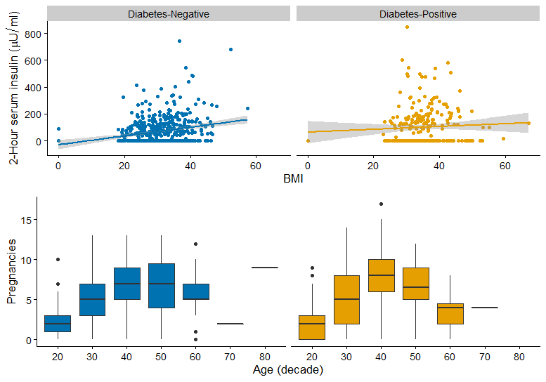
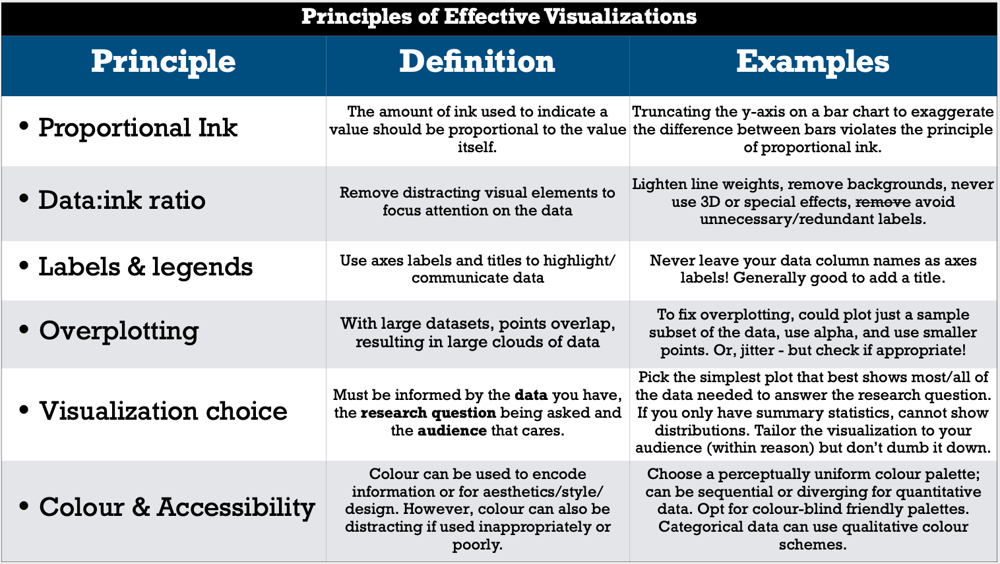
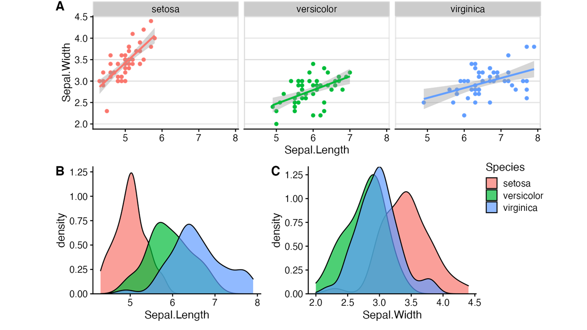

```{r include=FALSE}
knitr::opts_chunk$set(echo=TRUE)
```

```{r message=FALSE, warning=FALSE}
# loading required libraries
library(readr)
library(cowplot)
library(ggthemes)
library(tidyverse)
library(ggridges)
```

The biomedical data,  we are going to use is obtained from [Kaggle](https://www.kaggle.com/uciml/pima-indians-diabetes-database) website. You can find this dataset (`diabetes`) in a data folder. The dataset contains information about diabetes of cohort of sample subjects. This dataset arises from a research study of the National Institute of Diabetes and Digestive and Kidney Diseases (Smith et al. 1988). The purpose of the dataset is to predict whether or not a patient has diabetes. It is based on certain test measurements included in the dataset. Here, the patients are all females at least 21 years old of Pima Indian heritage.

The dataset consists of several medical predictors/features and one target/response variable named as Outcome: 

- `Pregnancies` - Number of times pregnant
- `Glucose` - Plasma glucose concentration a 2 hours in an oral glucose tolerance test
- `BloodPressure` - Diastolic blood pressure (mm Hg)
- `SkinThickness` - Triceps skin fold thickness (mm)
- `Insulin` - 2-Hour serum insulin (mu U/ml)
- `BMI` - Body mass index (weight in kg/(height in m)^2)
- `DiabetesPedigreeFunction` - Diabetes pedigree function
- `Age` - Age (years)
- `Outcome` - Diabetic outcome is given as binary, where “0” refers to norm.

# Task 1:


First import the dataset into the workspace:
```{r load-data}
# import the dataset into the workspace
diab<-read_csv("data/diabetes.csv") # It reads the CSV file and assigns to diab object
head(diab)
```


Please use the code chunk below to perform any modifications to original dataset.
```{r}
# Add any modification that is done to a dataset here

```

Reproduce the following figures using the `diab` dataset:

## 1.1 Violin 


```{r answer1.1, fig.height=6, fig.width=10}
# Plot

```

## 1.2 Ridge Plot


```{r answer1.2}
# Plot

  
```


## 1.3 Composite Plot: scatter plot and baxplot plot 


```{r answer 1.3,  fig.height=7, fig.width=10}
# Plot


```


# Task 2: Apply principles of effective visualizations

This exercise was adapted from emilyriederer [ugliest-ggplot-theme.R](https://gist.github.com/emilyriederer/2bf4f67d7e198f8359b61706c82e42ee) to to demonstrate the wide variety of `ggplot2 theme()` options.

Just as a reminder, refer to the principles of effective visualizations when completing this task.



Let's look at this plot:
```{r fig.height=6, fig.width=10}
# Plot
ggplot(diab %>%  filter(Age<50), 
       mapping = aes(x = BloodPressure, y = Pregnancies, col =age_decade)) + 
  geom_point(size = 5) + 
  facet_grid(Outcome ~ age_decade, switch = "y") +
  theme(
    plot.background = element_rect(fill = "lightyellow"),
    plot.title = element_text(size = 30, hjust = 0.25),
    plot.caption = element_text(size = 10, face = "italic", angle = 25),
    
    panel.background = element_rect(fill = 'lightblue', colour = 'darkred', size = 4),
    panel.border = element_rect(fill = NA, color = "green", size = 2),
    panel.grid.major.x = element_line(color = "purple", linetype = 2),
    panel.grid.minor.y = element_blank(),
    
    axis.title.x = element_text(face = "bold.italic", color = "blue"),
    axis.title.y = element_text(family = "mono", face = "bold", size = 20, hjust = 0.25),
    axis.text = element_text(face = "italic", size = 15),
    # note that axis.text options from above are inherited
    axis.text.x.bottom = element_text(angle = 180), 
    
    # generally will want to match w plot background
    legend.background = element_rect(fill = "orangered4"), 
    legend.key = element_rect(fill = "orange"),
    legend.direction = "horizontal",
    legend.position = "bottom") +
  
  labs(title = "Number of Times Pregnant vs Blood Pressure",
       subtitle = "this is not a nice plot",
       x = "Diastolic blood pressure (mm Hg)",
       y = "Number of times Pregnant",
       caption = "ages <50 are shown",
       col = "Renamed Legend") 
```

2.1 Summarize what is the role of arguments `plot.*`,`panel.*`,`axis.*`, and `legend.*`

<!-- Add your explanations here -->

2.2 Based on your interpretation of this bad plot, what research question do you think the plot-creators are trying to answer with this plot?

<!-- Add your explanations here -->

2.3 Using the principles of effective visualization, correct the figure. Comment on the steps you took to improve the plot and explain your choice.

```{r exercise2.3,  fig.height=6, fig.width=10}
# Modified Plot 


```

<!-- Add your explanations here -->

# Task 3: Advanced Figure Design

Using `iris` dataset reproduce the following plot: 




# Task 4: Making Ethical Data Decisions 

Imagine that during a survey , the patients were asked to answer the question of their ethnicity:

The Canadian Census identifies the following categories in its Census of the Population (see options below). Please indicate how you self-identify (you can select more than one category). This self-identification is not intended as an indication of one’s place of origin, citizenship, language or culture and recognizes that there are differences both between and among subgroups of persons of colour. If you are of mixed-descent, please indicate this by selecting all that apply, rather than using the “other” line unless parts of your self-identification do not appear in this list.

- Indigenous person of Canada (First Nations, Inuit, Métis)
- Indigenous (outside of Canada)
- Arab 
- Black 
- Chinese (including Hong Kong and Macau)
- Filipino
- Japanese
- Korean
- Latin, Central, or South American (e.g. Brazilian, Chilean, Colombian, Mexican) 
- South Asian (e.g. Indian, Pakistani, Sri Lankan, etc.)
- Southeast Asian (e.g. Cambodian, Indonesian, Laotian Vietnamese, etc) 
- West Asian (e.g. Afghan, Iranian, Syrian, etc) 
- White 
- None of the above
- Prefer not to answer

Import the dataset `ethnicity_data.csv` and  examine how "messy" the data input format. 
```{r}

```


Imagine you were tasked to present the data for the conference/board meeting to show the ethnic diversity of your patients.

## 4.1 Wrangling practice

First, try to convert the dataset in a more tidy form (For instance, making ethnicity labels shorter: `Chinese (including Hong Kong and Macau)` transformed to `Chinese`). Hint: you can create a new column for each ethnicity, and add value 1 if the person selected that category , and 0 if it was not selected. 
```{r exercise4.1}
# tidying up dataset 

```


## 4.2 Visualization Practice

Second, Try to create a visual to effectively show the diversity of patients' ethnicity. It can be either table or a figure. This task is not easy, so it is okey that your visual wont be perfect. Please discuss what aspects of your figure still needs improvement and describe or describe how you see the ideal images in this case.
```{r fig.height=10, fig.width=10}
# loaded extra libraries


```


# Submit Document

- knit the document to pdf file.you need to have a TinyTeX  to be able to knit the document:

```
install.packages('tinytex')
tinytex::install_tinytex()
```
- make sure the document is tidy, code chunks has sufficient comments, your writing is clear and has no typos.


# References

Smith, J.W., Everhart, J.E., Dickson, W.C., Knowler, W.C., & Johannes, R.S. (1988). Using the ADAP learning algorithm to forecast the onset of diabetes mellitus. In Proceedings of the Symposium on Computer Applications and Medical Care (pp. 261--265). IEEE Computer Society Press.